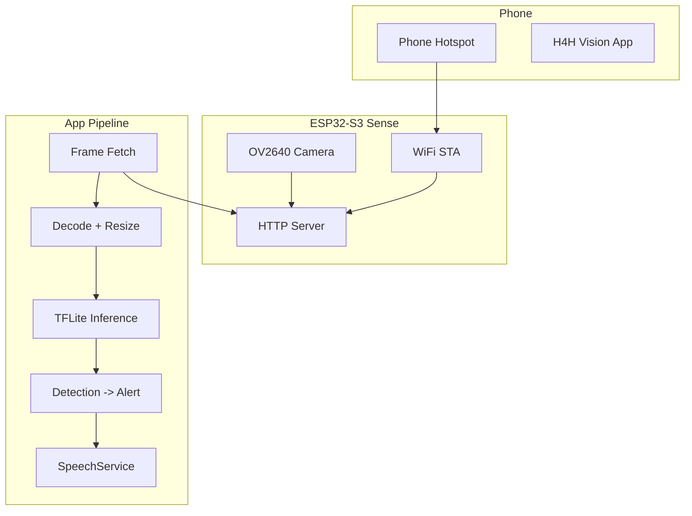

# H4H Vision App Bootstrap Plan

## Current State

The [mobile/](mobile/) app already has substantial scaffolding:

- **Video streaming**: [ESP32Service.js](mobile/src/services/ESP32Service.js) supports both JPEG snapshot polling (`/capture`) and MJPEG stream (`/stream`) over HTTP
- **Connection**: [useConnectionWatchdog.js](mobile/src/hooks/useConnectionWatchdog.js) monitors WiFi and pings the ESP32; [SettingsScreen.js](mobile/src/screens/SettingsScreen.js) lets users configure IP, port, and streaming mode
- **Audio**: [SpeechService.js](mobile/src/services/SpeechService.js) uses expo-speech for low-latency alerts and ElevenLabs for richer narration
- **UI**: [LiveVisionScreen.js](mobile/src/screens/LiveVisionScreen.js) displays frames and has a `processFrameWithTFLite` stub that returns `[]`

**Gap**: LiveVisionScreen always uses snapshot polling; it does not respect `config.useMjpeg`. TFLite is unimplemented. No ESP32 firmware or setup docs.

---

## Architecture

---

## Implementation Plan

### 1. Add TFLite Dependencies and Config

- Install `react-native-fast-tflite` and `jpeg-js` (for decoding JPEG to raw RGB)
- Extend [metro.config.js](mobile/metro.config.js) (create if needed) to include `tflite` in `resolver.assetExts`
- Add the react-native-fast-tflite Expo config plugin in [app.json](mobile/app.json); start with CPU inference (no GPU delegates) for stability; enable GPU delegates later if desired
- Add a default TFLite model asset, e.g. [SSD MobileNet v1 from TF Hub](https://tfhub.dev/google/lite-model/ssd_mobilenet_v1/1/default/1) (quantized, ~4MB), and place it in `mobile/assets/models/` (or similar)

### 2. Frame Preprocessing for TFLite

- Create `mobile/src/services/ImagePreprocessor.js`:
  - Input: base64 data-URI or `Uint8Array` JPEG bytes
  - Use `jpeg-js` to decode to raw RGB
  - Resize to model input size (e.g. 192x192 or 300x300) with a simple bilinear or nearest-neighbor algorithm in pure JS
  - Output: `Uint8Array` of shape `[height, width, 3]` for TFLite input

### 3. TFLite Inference Service

- Create `mobile/src/services/TFLiteService.js`:
  - Load model on mount (from bundled asset or remote URL)
  - `runInference(preprocessedFrame: Uint8Array): Promise<DetectionResult[]>` that:
    - Calls `model.runSync([preprocessedFrame])`
    - Parses SSD output tensors (boxes, classes, scores, num_detections) into `{ label, confidence, bbox }[]`
    - Applies confidence threshold (e.g. 0.5)
  - Handle model load errors gracefully (e.g. fallback to empty detections)

### 4. Navigation-Assistance Logic

- Create `mobile/src/services/NavigationAssistanceService.js`:
  - Map COCO/SSD labels to navigation-relevant cues (e.g. `person` -> "Person ahead", `car` -> "Vehicle nearby")
  - Decide when to speak vs stay silent (debounce, minimum interval between alerts to avoid chatter)
  - Call `speakAlert()` from [SpeechService.js](mobile/src/services/SpeechService.js) for critical alerts
- Integrate into [LiveVisionScreen.js](mobile/src/screens/LiveVisionScreen.js):
  - Replace `processFrameWithTFLite` stub with TFLiteService + ImagePreprocessor + NavigationAssistanceService
  - Pass each new frame through: preprocess -> infer -> map to alerts -> speak if needed

### 5. Wire MJPEG Mode in LiveVisionScreen

- In the effect that starts frame acquisition, branch on `esp32Config.useMjpeg`:
  - If `useMjpeg`: use `startMjpegStream()`; on each `Uint8Array` frame, convert to data-URI for display and pass to inference (decode via jpeg-js)
  - If not: keep `startSnapshotPolling()` as today
- Ensure `ESP32_DEFAULTS` includes `useMjpeg: false` for backward compatibility

### 6. ESP32 Firmware for XIAO ESP32-S3 Sense

- Create `esp32/` (or `firmware/`) with an Arduino sketch that:
  - Uses the [esp32cam](https://github.com/yoursunny/esp32cam) library and `pins::XiaoSense`
  - Connects to WiFi with SSID/password (phone hotspot credentials) — optionally via WiFiManager for first-time setup
  - Serves `/stream` (MJPEG) and `/capture` (single JPEG snapshot)
  - Adds a lightweight `/status` route for health checks
  - Document typical Android hotspot subnet (e.g. 192.168.43.x) and recommend static IP via DHCP reservation or WiFiManager

### 7. Persist and Load `useMjpeg` in Config

- Ensure [App.js](mobile/App.js) and AsyncStorage merge `useMjpeg` when loading config (SettingsScreen already saves it; verify ESP32_DEFAULTS and load logic include it)

### 8. Documentation

- Extend [README.md](README.md) with:
  - Phone hotspot setup (enable hotspot, note SSID/password)
  - ESP32 flash and WiFi configuration
  - App install via `expo run:android` / `expo run:ios` (dev build)
  - How to configure ESP32 IP in Settings if different from default

---

## Key Files to Create or Modify

| Action | File                                                                       |
| ------ | -------------------------------------------------------------------------- |
| Create | `mobile/metro.config.js` (if missing)                                      |
| Modify | `mobile/package.json` (add tflite, jpeg-js)                                |
| Modify | `mobile/app.json` (tflite plugin)                                          |
| Create | `mobile/src/services/ImagePreprocessor.js`                                 |
| Create | `mobile/src/services/TFLiteService.js`                                     |
| Create | `mobile/src/services/NavigationAssistanceService.js`                       |
| Modify | `mobile/src/screens/LiveVisionScreen.js` (TFLite + MJPEG + alerts)         |
| Modify | `mobile/src/services/ESP32Service.js` (add useMjpeg to DEFAULTS if needed) |
| Create | `esp32/` or `firmware/` Arduino sketch                                     |
| Modify | `README.md`                                                                |

---

## Technical Notes

- **TFLite + Expo**: react-native-fast-tflite works with Expo dev builds. Use CPU inference initially; GPU delegates can cause compatibility issues.
- **Frame format**: SSD MobileNet typically expects `[1, H, W, 3]` uint8 RGB. Use Netron to confirm exact input shape for the chosen model.
- **ESP32 endpoints**: The esp32cam library uses `/stream` for MJPEG. Add a `/capture` handler that captures one frame and returns JPEG.
- **Phone hotspot**: Android hotspots often use 192.168.43.1 as gateway; ESP32 should get an IP in 192.168.43.x. iOS Personal Hotspot may use a different subnet.

